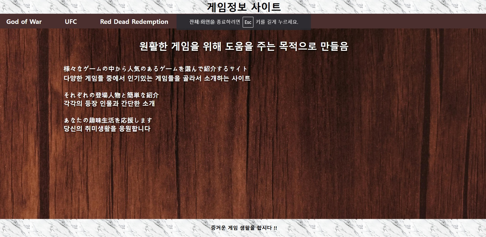
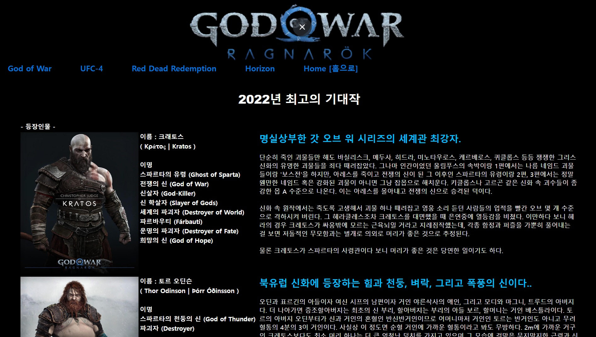
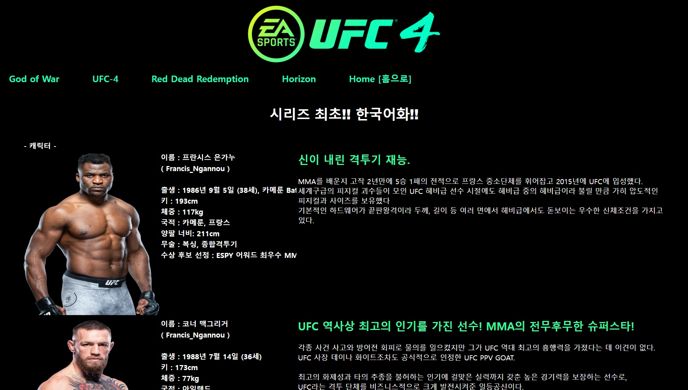
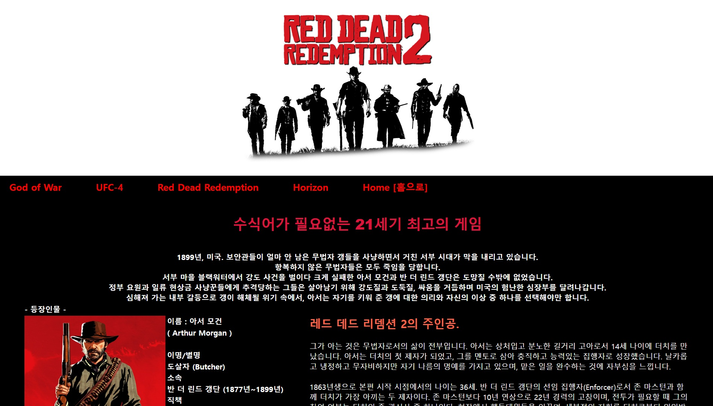
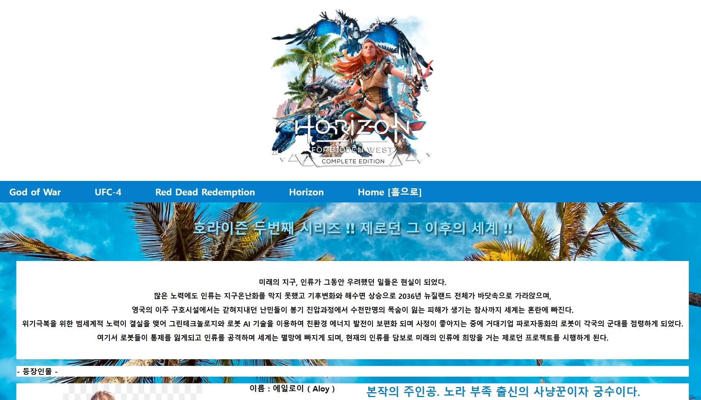

# 🎮 Project1 Collection

JSP와 HTML/CSS를 활용한 웹 콘텐츠 연습 프로젝트입니다.  
각 게임 컨셉을 테마로 웹페이지를 구성했으며,  
 
각 JSP 페이지 결과 화면을 캡처하여 정리했습니다.

---

## 🖼️ 메인 이미지

---

## 📸 구현 결과 미리보기

### 🔹 God of War

### 🔹 UFC-4

### 🔹 Red Dead Redemption

### 🔹 Horizon

> 📂 캡처 이미지는 `README/` 폴더에 정리되어 있습니다.  
> 각 이미지 파일은 `git add` 후 함께 푸시해야 GitHub에서 보입니다.

---

## 🛠 주요 특징
- JSP 기반 페이지 구성
- HTML + CSS 스타일링
- 주제별 이미지 자료 정리
- `.gitignore` 적용으로 환경설정 파일 제외

---

## 🧑‍💻 작성자
- GitHub: [JOYUNAM](https://github.com/JOYUNAM)